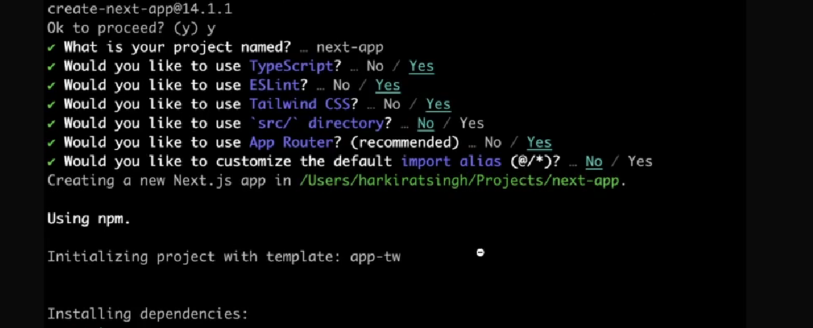

npx create-next-app@latest

learning nextJs  
9 -7 -2024

file based routing(as u create the file in way that way the URL will be )
file/my/name/is /username

layout.tsx is has all the meta data of root

## if u create the folder using

it will ignore the this path (auth)
before /auth/signup
after /signup

### try differ the client side components

if not then those would not be the SEO optimize

we dont have the cores issue in the next js
